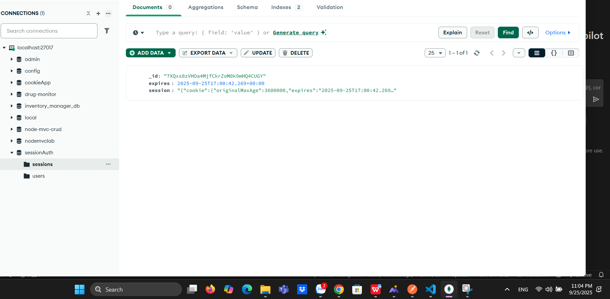

# Simple Auth – Basic Authentication

## Mo ta
Du an minh hoa<credentials>.

## Cai dat va chay
Chay cac lenh sau trong terminal:
npm install
node app.js

Test Postman: URL: http://localhost:3000/auth/register User: admin Pass: 12345
Test Postman: URL: http://localhost:3000/auth/login User: admin Pass: 12345

